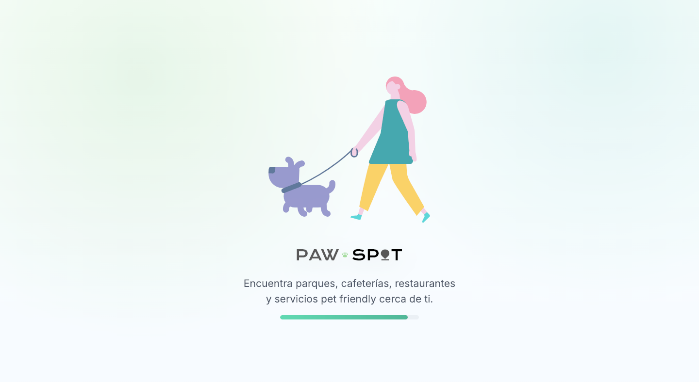
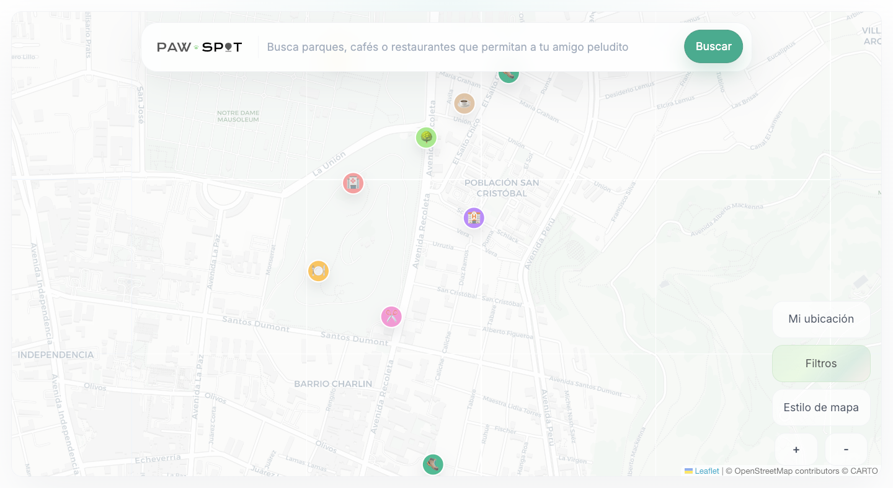
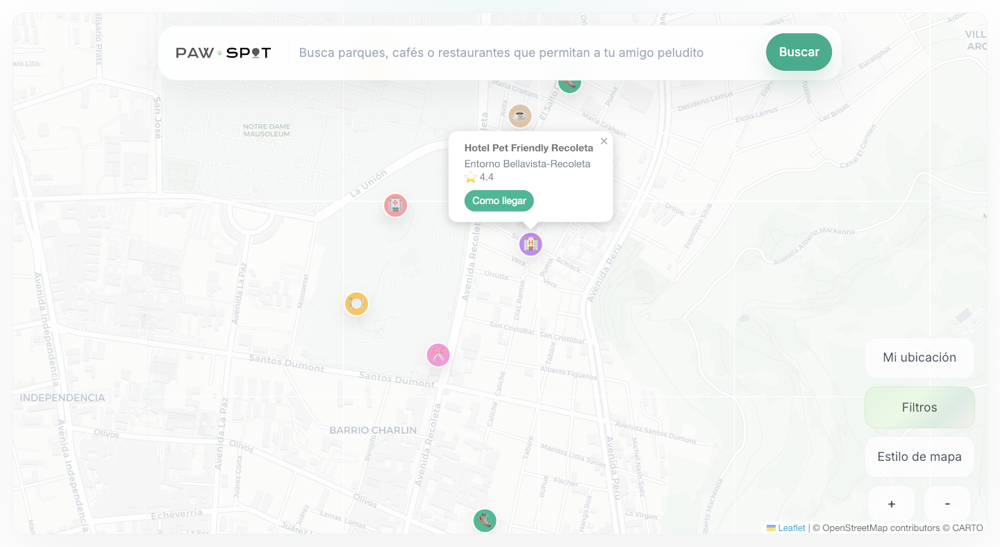
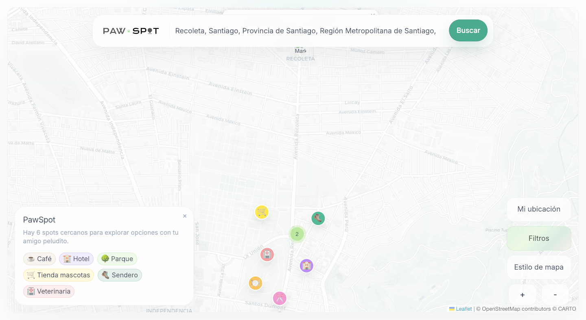

# PawSpot


PawSpot is a map-first Angular application for discovering pet-friendly places with a modern mobile-first UI.

## App Preview

<p align="center">
  
  
  
  
</p>

## Highlights

- Angular standalone architecture with lazy loading
- Real OpenStreetMap integration using Leaflet
- User geolocation support
- Marker clustering
- Signals and OnPush strategy
- ESLint + Prettier + Husky + lint-staged

## Tech Stack

- Angular 22
- TypeScript
- Tailwind CSS 4
- Leaflet + OpenStreetMap + MarkerCluster
- Vitest (via Angular test command)

## Requirements

- Node.js LTS (project validated with Node 24)
- npm (project uses npm lockfile)

## Quick Start

```bash
npm install
npm start
```

Default URL:

- http://localhost:4200/

If 4200 is busy, Angular will suggest a different port.

## Available Scripts

```bash
npm start
npm run build
npm run test
npm run lint
npm run format
npm run format:check
```

## Project Structure

```text
src/
  app/
  core/
  shared/
  features/
    map/
```

## Quality Checks

```bash
npm run format:check
npm run lint
npm run build
```

## Documentation

- Contribution guide: [CONTRIBUTING.md](CONTRIBUTING.md)
- Changelog: [CHANGELOG.md](CHANGELOG.md)
- License: [LICENSE](LICENSE)

## Notes

- This repository is intended for portfolio and professional review.
- Keep commits focused and descriptive.
